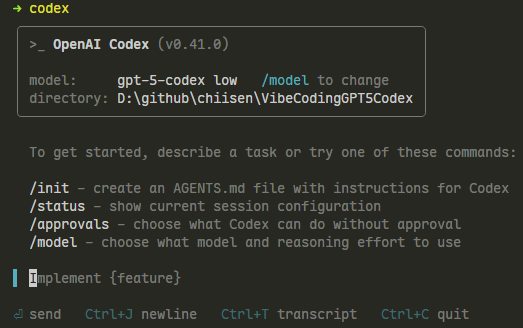

# Vibe Coding GPT-5 Codex
Vibe Coding GPT-5 Codex

GPT-5 Codex 是 OpenAI 於2025年推出的一個基於 GPT-5 架構，專門針對軟體工程及程式開發任務優化的版本。它並非一個全新模型，而是在 GPT-5 的基礎上通過強化學習，結合現實工程工作流程設計的資料集，進行微調，使其更適合大型專案的多步驟程式碼產生、運行測試、錯誤修復、重構、程式碼審查等一系列真實軟體開發工作。

GPT-5 Codex 最大特點包括能自主長時間（可達7小時以上）連續且深入地執行複雜開發任務，不斷自我修正和優化，並有高度的跨工具整合能力（例如命令列介面CLI、整合開發環境IDE、GitHub、雲端平台及手機App），成為開發者工作流中重要的智能協作者，而非單純的輔助工具。 它能理解專案結構與依賴，執行真實測試並驗證程式碼行為，提升了程式碼重構和多檔案推理的精確度和可靠度。

此外，GPT-5 Codex 採用動態推理策略，針對任務簡單快速回應，對於複雜問題則投入更多思考時間，優化了效能與準確度的平衡。它被視為軟體開發領域有里程碑意義的AI程式設計師，能深度參與大型軟體工程專案的多階段流程，顯著提升開發效率與質量。

# GPT-5-Codex



## 安裝
在 Node.js 20
```bash
npm install -g @openai/codex
```

## 啟動
```bash
codex
```
1. 執行後會開啟網頁並登入驗證帳號
2. 必須要有訂閱才能使用

